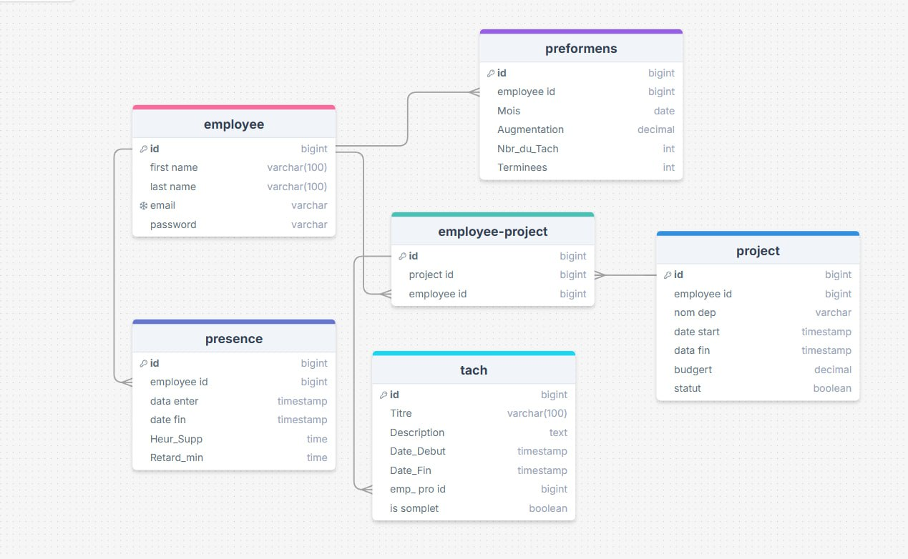

# Our First Big Project Report

**Group Members:** Benomrane Nourdine, ben adballah nour aicha,terfaia anas ,amal guenda athmani chahinaz.
**Date:** [2026/2027]

## 1. What We Made

For our project, we built a website that helps a company keep track of its employees and the projects they are working on. It's a "full-stack" application.

The main idea was to make a simple system where a boss (an "admin") can add new projects and see who is working on what. Regular employees can log in and see the tasks they need to do.

## 2. How It's Put Together

We learned about the "three-tier architecture," which sounds complicated but just means the project is split into three main parts:

*   **The Frontend:** This is the actual website you see in a browser. We used HTML, CSS, and JavaScript to build it.
*   **The Backend:** This is like the brain of the website. It runs on a server and does all the thinking, like handling logins and saving data.
*   **The Database:** This is where all the information is stored, like a big, organized spreadsheet.

Splitting it up like this made it much easier for our group to work on different parts at the same time without getting confused.

## 3. The Backend (The Brain)

This was the most challenging but also the most interesting part for us.

*   **Tools We Used:** We used Node.js and Express.js. Express is a "framework" that makes building the backend with Node.js a lot easier. We also used  `nodemon` that automatically restarted our server every time we saved a file, for fast testing.

*   **Making it Secure:** We learned that you can't just save passwords as plain text. We used a library called `bcrypt` to "hash" the passwords, which scrambles them up so they are secure. We also used `jsonwebtoken` (JWT) to make sure that once a user logs in, they stay logged in securely.

*   **The API:** The backend's main job is to be an "API" (Application Programming Interface). This is just a way for the frontend to ask the backend for information or to tell it to do something. We created different routes for things like getting a list of employees or adding a new project.

## 4. The Frontend (The Face)

This is the part of the project that people actually see and click on.

*   **Tools We Used:** We stuck to the basics here: HTML for the page content, CSS to make it look nice, and JavaScript to make it interactive.

*   **What You See:** We made a few different pages:
    *   A login page.
    *   A dashboard for the admin to see everything.
    *   A page for employees to see their own stuff.
    *   Pages with forms to create new projects and tasks.

*   **Making it Work:** The JavaScript on the frontend is what talks to the backend API. When you click a button, the JavaScript sends a request to the backend. For example, when you log in, `login.js` sends your username and password to the server, and if it's correct, the server sends back a token that the browser saves.

## 5. The Database (The Memory)

The database is where everything is stored. Without it, all the projects and employee info would disappear as soon as you close the website.

*   **The System:** We used PostgreSQL, which is a type of "relational database." This means it stores data in tables with rows and columns, kind of like Excel.

*   **The Tables:** 
        

*   **Testing Data:** We made a file called `dummydata.js` to fill our database with fake information. This was really useful for testing our website without having to manually type in a bunch of users and projects every time.

    

## 6. Contribution Table

| Name                      | Contribution                                                  |
| :------------------------ | :------------------------------------------------------------ |
| Benomrane Nourdine        | Frontend (Homepage, Login Page)                               |
| anas terfaia              | Frontend (Admin, Create Project, Create Task, Employee pages) |
| ben adballah nour aicha   | Database Design and Setup (`init_database.sql`)               |
| amal guenda               | Backend (Routes for Employees, Projects, Tasks)               |
| athmani chahinaz          | Backend (Routes for Performances, Presences, Employee-Projects) |

## 7. What We Learned

This project was a huge learning experience for our group. It was the first time we built a complete application from front to back. Getting the frontend and backend to talk to each other correctly was kinda hard at first, but it was really cool to see it finally work. We feel like we have a much better understanding of how modern websites are built now. The project isn't perfect, but we're proud of what we were able to accomplish together.
